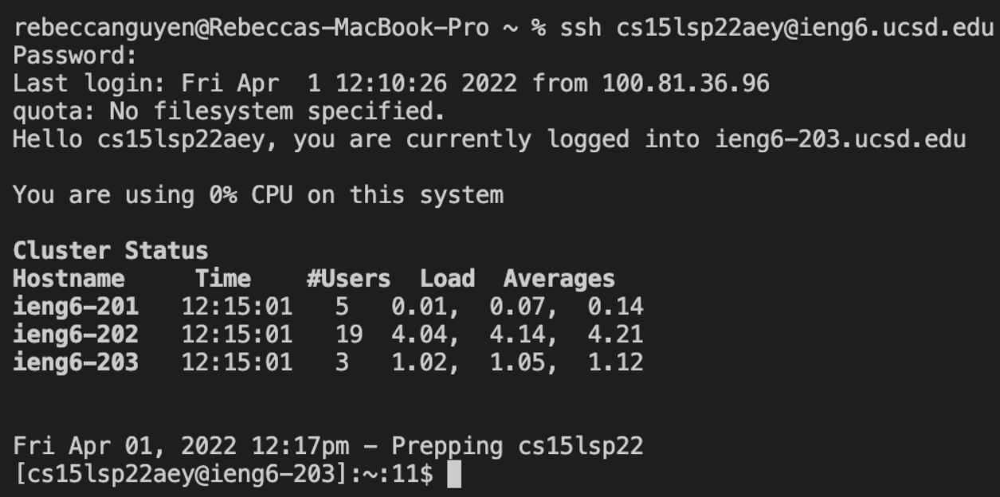
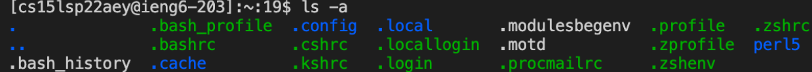
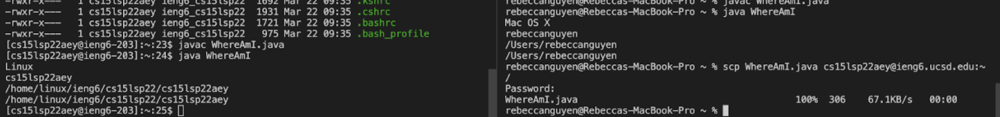

# Welcome incoming 15L students! 
## Today you will be learning how to log into a course-specific acount on **ieng6**
---
## Installing Visual Studio Code

First, you must download [Visual Studio Code]( https://code.visualstudio.com/) (VScode).

After downloading VScode, open a window and you should get something similar to this picture:


---

## **Remotely Connecting**

Now, you need to find your CSE15L course-specific account *[here](https://sdacs.ucsd.edu/~icc/index.php)*.

After you find your course-specific account, open a new terminal in VSCode (Ctrl + ` or Terminal -> New Terminal menu option) and type:

```
$ ssh cs15lsp22zz@ieng6.ucsd.edu
```

**Note:** replace `zz` with the letters in your course-specific account

You will get this message since it is your first time connecting to this server: 

```
⤇ ssh cs15lsp22zz@ieng6.ucsd.edu

The authenticity of host 'ieng6.ucsd.edu (128.54.70.227)' can't be established.

RSA key fingerprint is SHA256:ksruYwhnYH+sySHnHAtLUHngrPEyZTDl/1x99wUQcec.

Are you sure you want to continue connecting (yes/no/[fingerprint])?
```

Type `yes` and press enter. It will prompt you for a password. Type in your password (it will not be shown in the terminal). 

You will get something like this:


Your terminal is now connected to a computer in the CSE basement! Any commands you run will run on that computer. 

Your computer is the `client`, while the basement computer is the `server`.

---

## **Useful commands**

> Some commands to remember:

* cd ~
* cd
* ls -lat
* ls -a
* ls /home/linux/ieng6/cs15lsp22/cs15lsp22abc (replace abc with a username)
* cp /home/linux/ieng6/cs15lsp22/public/hello.txt ~/
* cat /home/linux/ieng6/cs15lsp22/public/hello.txt

Try these out on both the client and server and see what they do and how they are different. 

For example, *ls -a* organizes the home directory into alphabetical order.



**Note:** To log out of the remote server in your terminal, use `Ctrl-D` or type and run `exit`

---

## **Moving Files into `scp`**

Now we will be learning how to copy files back and forth between your computer and the remote computer using the command `scp`, which will *always* be ran from the `client`.

First, create a file named **WhereAmI.java** with this code:

```
class WhereAmI {
  public static void main(String[] args) {
    System.out.println(System.getProperty("os.name"));
    System.out.println(System.getProperty("user.name"));
    System.out.println(System.getProperty("user.home"));
    System.out.println(System.getProperty("user.dir"));
  }
}
```

You can use *javac* and *java* to run it on the `client`.

Now, run this command (using your username):
```
scp WhereAmI.java cs15lsp22zz@ieng6.ucsd.edu:~/
```
Similar to when you log in with `ssh`, you will be asked to enter your password. 

Enter your password to log in and run `ls`. You will see the **WhereAmI.java** file in your home directory! 

Now you can use *javac* and *java* to run it on the `server`.

Here, on the right is the client and on the left is the server. 



After running javac and java, I ran scp WhereAmI.java cs15lsp22zz@ieng6.ucsd.edu:~/ and entered my password. 


---

## **Setting an SSH Key**

---

## **Omptimizing Remote Running**


---


We will be using [Autograder](https://autograder.ucsd.edu/queue/tickets/543652) as the student queue during TA/tutor office hours.