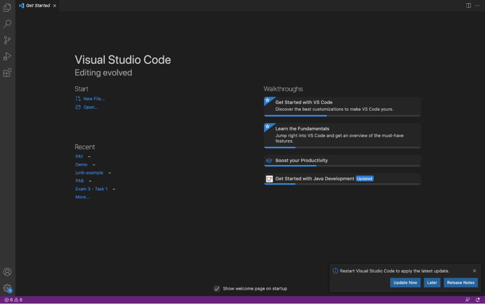

# Welcome incoming 15L students! 
## Today you will be learning how to log into a course-specific acount on **ieng6**

First, you must download [Visual Studio Code]( https://code.visualstudio.com/) (VScode).

After downloading VScode, open a window and you should get something similar to this picture:

We will be using [Autograder](https://autograder.ucsd.edu/queue/tickets/543652) as the student queue during TA/tutor office hours.