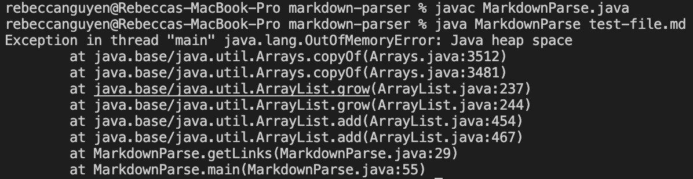

# Lab Report 2
```
Name: Rebecca Nguyen
PID: A16808281
```

> ## Error #1

The first change we made to `MarkdownParse.java` was to accomodate for the alternative way of writing a link in GitHub. This change was sparked by an error in the test file [test-file2.md](https://raw.githubusercontent.com/rebenguy/markdown-parser/main/test-file2.md).

When we ran the program, we were faced with an `OutofMemoryError` error:


However, when we deleted **`[1]:http://url/b.jpg`** from the test file, the program worked and printed out the links:


This meant that **`[1]:http://url/b.jpg`** was the line causing an error, thus showing that the **bug** was that the program can only read `[Link][1]` and not `[1]:http://url/b`.jpg.

The **bug** is that the program causes an infinite loop since the code searches for an open parathesis `"("` after the closed bracket `"]"`. Since `[1]:http://url/b.jpg` is the last line in the file and doesn't have an open paranthesis `"("`, the program returns `-1`, assigning `openParen = -1`. The code also doesn't have a closed parenthesis `")"`, so the program returns `-1` again, assigning `closedParen = -1`. `currentIndex = closeParen + 1` would assign `currentIndex = 0`, and since `currentIndex` is less than `markdown.length`, the while loop loops again. Without an open or closed parenthesis, `currentIndex` will keep becoming `0`, and the while loop will continue to stay true, causing a **symptom** of the program being stuck in an infinite loop:


*`(We included a System.out.println("Infinite loop"); to check)`*

We needed the program to be able to read in the second way of writing a link `([1]:http://url/b.jpg)` and print it. To do this, we made the program read in the next character after the closed bracket `"]"` and compared it to `"("` or `":"`. 

If the next character is `"("`, then print the substring inside the parenthesis `()`. 

If the next character is `":"`, then find the index of `"."` and +3 to the index for the `edu/com/org/etc`. and print the substring from after `":"` to the index of `"."` +3:


When we ran the program after updating `MarkdownParse.java`, it was successful in printing out `[http://url/b.jpg]` from `[1]:http://url/b.jpg`:


---

> ## Error #2

The second change we made to `MarkdownParse.java` was to break if there is no link. This change was made due to an error in [test-file6.md](https://raw.githubusercontent.com/rebenguy/markdown-parser/main/test-file6.md), where there is no link after the brackets `[]`.

When we ran the program, it kept running and we were forced to `Ctrl + C` to quit the terminal. As such, we knew this was an infinite loop error: 


Similarly to `Error #1`, the **bug** within the program is that the program causes an infinite loop since the code searches for an open parathesis `"("` or colon `":"` after the closed bracket `"]"`. Since we fixed `Error #1` by having the program detect whether the next character after the closed bracket `"]"` is an open parenthesis `"("` or a colon `":"`, if the program does not detect either one after the closed bracket `"]"`, the `if-statement` does not return True and thus does not run. As such, `currentIndex` remains `0`, and since `currentIndex` is less than `markdown.length`, the while loop loops again. This causes a **symptom** of the program being stuck in an infinite loop:


*`(We included a System.out.println("Infinite loop"); to check)`*

To make sure that the program realizes when there is no link, we simply added an `else-statement` to the end of the `if-else-if-statement` to `break`. This ensures that if the program does not read in an open parenthesis `"("` or colon `":"`, the program will break and exit the while loop. 


---

> ## Error #3

The third change we made to `MarkdownParse.java` was to accomodate for when there is an empty line after the links. This change was made due to an error in [test-file.md](https://raw.githubusercontent.com/rebenguy/markdown-parser/main/test-file.md).

When we ran the program after fixing `Error 1` and `Error 2`, we got an `OutofMemoryError` error:



Like `Error 1` and `Error 2`, the **bug** is that the program causes an infinite loop since the code searches for an open bracket `"["` after the closed parenthesis `")"`. Since there is an empty line, the program thinks that there is more to the file. Furthermore, since there is no open bracket `"["` after the closed parenthesis `"("`, the program returns `-1`, assigning `openBracket = -1`. The code also doesn't have a closed bracket `"]"`, so the program returns `-1` again, assigning `closedBracket = -1`. Since `char next = markdown.charAt(closeBracket + 1);` would be `char next = markdown.charAt(-1 + 1);`, the program assigns next as the character at index 0, which is `[`. Thus, the `if-else-statement` would return `False` and not run. This would mean that `currentIndex` would not be changed, and the while loop loops again. This causes a **symptom** of the program being stuck in an infinite loop:


*`(We included a System.out.println("Infinite loop"); to check)`*

To resolve this, we created two `if-statements`:

```
if (openBracket == -1 || closeBracket == -1) {
    break;
}
```
```
if (openParen == -1 || closeParen == -1){
    break;
}
```

This means that the program will  beak and exit the while loop if openBracket, closeBracket, openParen, or closeParen = -1:

