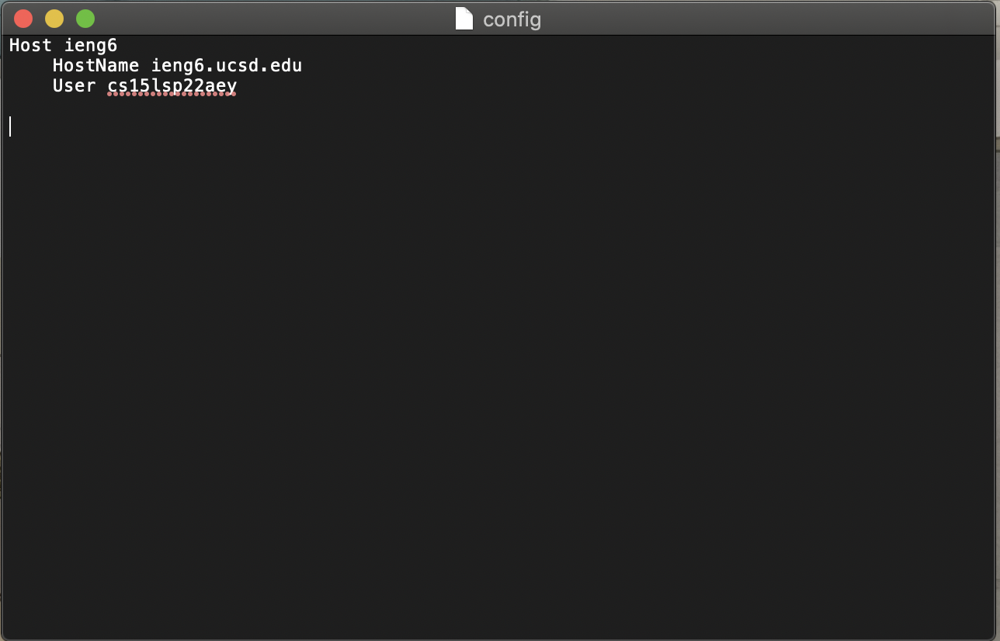
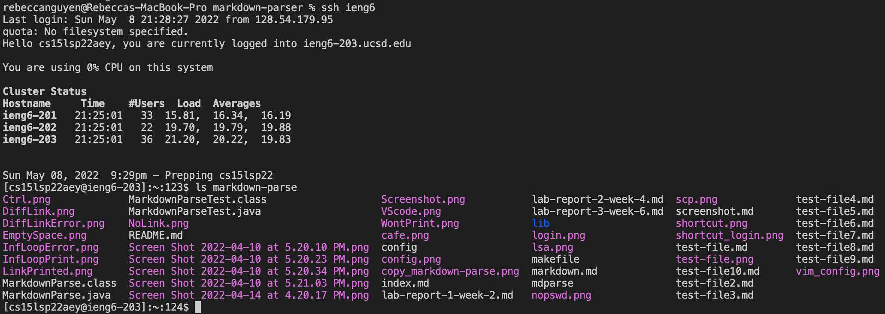

# Lab Report 3
```
Name: Rebecca Nguyen
PID: A16808281
```

> ## Streamlining `ssh` Configuration

When you log into your course specific account, you have to type something like this:

`$ ssh cs15lsp22zzz@ieng6.ucsd.edu`

SSH has configuration files that can shorten this login, such as **~/.ssh/config**, which tells SSH what username to use when loggin into specific servers. 

To create ~/.ssh/config, type in **`vim config`** into the VSCode termal and it should lead to this:


Once this pops up, simply paste these lines:

```
Host ieng6
    HostName ieng6.ucsd.edu
    User cs15lsp22zzz (your username)
```

**Note:** ieng6 after Host is the username for the lines above. It can be replaced with a preferred username.

To save and exit, press the **`Esc`** key, then enter **`:x`**, and finally press **`Enter`**. Now this should create a file named `config` containing this: 



Now just simply type `ssh ieng6` into the terminal and it should use the key and log in with the specified username using the public key. It should look along the lines of this:


Now, you can enter ieng6 in place of cs15lsp22zzz@ieng6.ucsd.edu. An example of this is using an `scp` command to copy a file to your account. 

Instead of entering: 

```
scp -r *.java *.md lib/ cs15lsp22zzz@ieng6.ucsd.edu:markdown-parse
```

You can enter:

```
scp -r *.java *.md lib/ieng6:markdown-parse        
```

They do the exact same thing but the second option lessens the amount you have to type, increasing efficiency. It should look something like this when you execute the command to copy a file to your account: 


---
> ## Setup Github Access from ieng6

Currently, we're not able to commit and push from the command line on our ieng6 account. To resolve this, we can add a *public key* following these [instructions](https://docs.github.com/en/authentication/connecting-to-github-with-ssh/adding-a-new-ssh-key-to-your-github-account).

After following these instructions, we can locate where the public key we made is stored on Github and in our user account. 

On the Github webstie, go to settings and press the `SSH and GPG keys` tab. This shows all the ssh keys that you have created, including the public key that was just created:


Now to find where the public key is stored in the course specific account, log into your course specific account using `ssh ieng6`, change the directory to .ssh by entering `cd. ssh`, and `ls`. After, we can use `cat (id_name.pub)` to view the contents of the file. If done correctly, it should look something like this:


We can also identify where the private key we made is stored on our user account by following the same directions to find where the public key we made is stored. After logging into our course specific account and changing to the .ssh directory, enter ls. Here, the private key is `id_rsa`:


---
> ## Copy whole directories with `scp -r`

We can use `scp` not only to copy files to a remote server, but also entire directories, including all the files and directories in it. This is called copying *recursively*. To do this, enter this into the VSCode terminal:

```
scp -r . cs15lsp22zzz@ieng6.ucsd.edu:~/markdown-parse (your username)
```

The `-r` tells scp to work recursively, `.` is the *source*, and `~/markdown-parse` tells scp to create the markdown-parse directory on the remote server and copy the contents of the directory recursively there. After entering the line above, the terminal should show something like this:

 

Now, you can log into the server using ssh and see that all the files are in a directory titled `markdown-parse`:



Now that the entire markdown-parse directory has been copied to the remote server, you can change into the markdown-parse directort and compile and run tests for your repository on the remote server:


You can combine `scp`, `:`, and `ssh` to copy the whole directory and run the tests in one line. This can be done using the line below: 

```
scp -r . ieng6:~/markdown-parse; ssh ieng6 "cd markdown-parse "javac -cp .:lib/junit-4.13.2.jar:lib/hamcrest-core-1.3.jar MarkdownParseTest.java; java -cp .:lib/junit-4.13.2.jar:lib/hamcrest-core-1.3.jar org.junit.runner.JUnitCore MarkdownParseTest""
```
* `scp -r . ieng6:~/markdown-parse` copies the directory recursively to the remote server 

* `ssh ieng6` logs into the course specific account

* `cd markdown-parse` changes to the markdown-parse directory

* `javac -cp .:lib/junit-4.13.2.jar:lib/hamcrest-core-1.3.jar MarkdownParseTest.java; java -cp .:lib/junit-4.13.2.jar:lib/hamcrest-core-1.3.jar org.junit.runner.JUnitCore MarkdownParseTest` compile and run the tests:


**...** 
