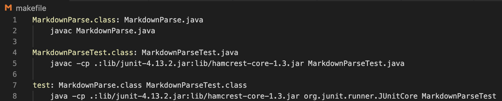

# Lab Report 4
```
Name: Rebecca Nguyen
PID: A16808281
```

---

> # Overview

In Week 7, we reviewed another group's markdown-parse. In this Lab Report, we will be testing our markdown-parse and that group's markdown-parse on three snippets. Testing these snippets will help us determine in what ways we can improve our markdown-parse.

To access our markdown-parse repository, click this [link](https://github.com/rebenguy/markdown-parser).

To access the other group's markdown-parse repository, click this [link](https://github.com/gabrielseventhucsd25/markdown-parser).

---

> # Snippet 1

The first snippet we are testing is: 

```
`[a link`](url.com)

[another link](`google.com)`

[`cod[e`](google.com)

[`code]`](ucsd.edu)
```

According to VSCode preview, this snippet should produce the following valid links output: ```[`google.com, google.com, ucsd.edu]```


To test this snippet, I created a JUnit test case in both mine and the other group's MarkdownParseTest.java. This test case will check whether or not our markdown-parse will produce the valid links output or not. The JUnit test code I implemented is:


I then created a makefile on both markdown-parse that has the following code:



Now, all I have to do is type in `make test` into the terminal and press enter to run MarkdownParseTest.java.

---

> ## Snippet 1 Outcome

After running `make test`, the test case for Snippet 1 on both mine and the other group's markdown-parse failed. This was because we got different outputs than what was expected.

This is the error message that was produced for Snippet 1 for my markdown-parse: 


The output I received was: ```[url.com, `google.com, google.com]```

This is not the same as the expected output: ```[`google.com, google.com, ucsd.edu]```

This is the error message that was produced for Snippet 1 for the other group's  markdown-parse: 


The output they received was: ```[url].com, google.com, ucsd.edu]```

This is not the same as the expected output: ```[`google.com, google.com, ucsd.edu]```

---

> ## Snippet 1 Question

Do you think there is a small (<10 lines) code change that will make your program work for snippet 1 and all related cases that use inline code with backticks? If yes, describe the code change. If not, describe why it would be a more involved change.

* I think there is small code change that will make my program work for cases that use incline code with backticks. I can edit markdown-parse so that it can check for any backticks. If the backticks are only inside of the brackets and parenthesis, it should be a valid link. However, if there are backticks on the outside of the brackets and parenthesis, the program should check for base cases, such as whether or not there is only one backtick, whether or not it is in between ](, etc. Depending on the number and placement of the backticks, the program can determine if it will produce a valid link.

> # Snippet 2

The second snippet we are testing is: 

```
[a [nested link](a.com)](b.com)

[a nested parenthesized url](a.com(()))

[some escaped \[ brackets \]](example.com)
```

According to VSCode preview, this snippet should produce the following valid links output: ```[a.com, a.com(()), example.com]```


To test this snippet, I created a JUnit test case in both mine and the other group's MarkdownParseTest.java. This test case will check whether or not our markdown-parse will produce the valid links output or not. The JUnit test code I implemented is:


I then use the makefile I created to run MarkdownParseTest.java by typing `make test` into the terminal and pressing enter.

---

> ## Snippet 2 Outcome

After running `make test`, the test case for Snippet 2 on both mine and the other group's markdown-parse failed. This was because we got different outputs than what was expected once again.

This is the error message that was produced for Snippet 2 for my markdown-parse: 


The output I received was: ```[a.com, a.com(([]]```

This is not the same as the expected output: ```[a.com, a.com(()), example.com]```

This is the error message that was produced for Snippet 2 for the other group's  markdown-parse: 


The output they received was: ```[[(b].com, a.com(()), example.com]```

This is not the same as the expected output: ```[a.com, a.com(()), example.com]```

> ## Snippet 2 Question

Do you think there is a small (<10 lines) code change that will make your program work for snippet 2 and all related cases that nest parentheses, brackets, and escaped brackets? If yes, describe the code change. If not, describe why it would be a more involved change.

* I think there isn't a small code change that will make my program work for cases that use nest parentheses, brackets, and escaped brackets. This is because I would have to check for several things. These things would include proper formatting of the nested parenthesis, brackets, and escaped brackets, whether or not they are complete `(such as [], (), or \\)`, whether or not there are links within links, etc. Taking all these things into account, I would assumed it would take more than 10 lines to implement.

> # Snippet 3

The third snippet we are testing is: 

```
[this title text is really long and takes up more than 
one line

and has some line breaks](
    https://www.twitter.com
)

[this title text is really long and takes up more than 
one line](
https://sites.google.com/eng.ucsd.edu/cse-15l-spring-2022/schedule
)


[this link doesn't have a closing parenthesis](github.com

And there's still some more text after that.

[this link doesn't have a closing parenthesis for a while](https://cse.ucsd.edu/


)

And then there's more text
```

According to VSCode preview, this snippet should produce the following valid links output: ```https://sites.google.com/eng.ucsd.edu/cse-15l-spring-2022/schedule```


To test this snippet, I created a JUnit test case in both mine and the other group's MarkdownParseTest.java. This test case will check whether or not our markdown-parse will produce the valid links output or not. The JUnit test code I implemented is:


I then use the makefile I created to run MarkdownParseTest.java by typing `make test` into the terminal and pressing enter.

---

> ## Snippet 3 Outcome

After running `make test`, the test case for Snippet 3 on both mine and the other group's markdown-parse failed. This was because we got different outputs than what was expected again.

This is the error message that was produced for Snippet 3 for my markdown-parse: 


The output I received was: 
```
    https://www.twitter.com
, 
https://sites.google.com/eng.ucsd.edu/cse-15l-spring-2022/schedule
, github.com

And there's still some more text after that.

[this link doesn't have a closing parenthesis for a while](https://cse.ucsd.edu/
```

This is not the same as the expected output: ```https://sites.google.com/eng.ucsd.edu/cse-15l-spring-2022/schedule```

This is the error message that was produced for Snippet 3 for the other group's  markdown-parse: 


The output they received was: ```https://[www.twitter.com, /schedule, https://cse.ucsd.edu/, ), text```

This is not the same as the expected output: ```https://sites.google.com/eng.ucsd.edu/cse-15l-spring-2022/schedule```

---

> ## Snippet 3 Question

Do you think there is a small (<10 lines) code change that will make your program work for snippet 3 and all related cases that have newlines in brackets and parentheses? If yes, describe the code change. If not, describe why it would be a more involved change.

* I think there is a small code change that will make my program work for cases that have newlines in brackets and parenthesis. I think that to solve this, can I can make the program detect empty lines. This way, if there is an empty line between the brackets or parenthesis, it will not be considered as a valid link. However, if the format of the link is correct, the ]( are together (not separated into different lines), and there are no empty lines in between, the link should be valid.


I think there is small code change that will make my program work for cases that use incline code with backticks. I can edit markdown-parse so that it can check for any backticks. If the backticks are only inside of the brackets and parenthesis, it should be a valid link. However, if there are backticks on the outside of the brackets and parenthesis, the program should check for base cases, such as whether or not there is only one backtick, whether or not it is in between ](, etc. Depending on the number and placement of the backticks, the program can determine if it will produce a valid link.