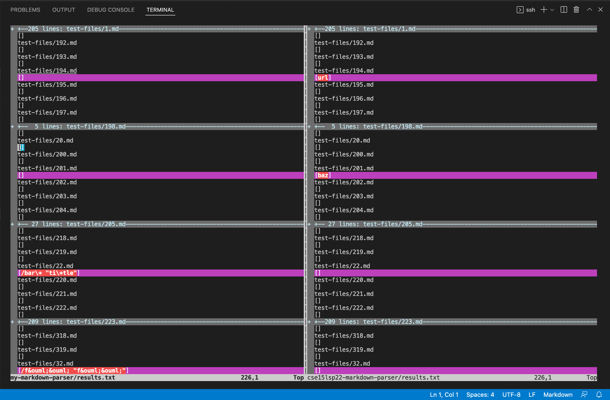
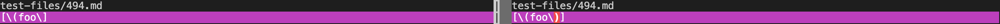
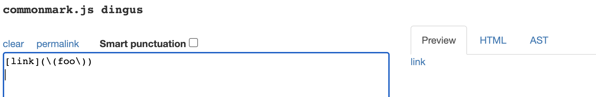
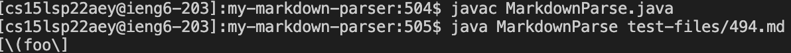
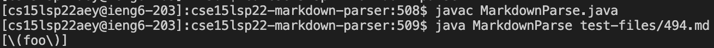
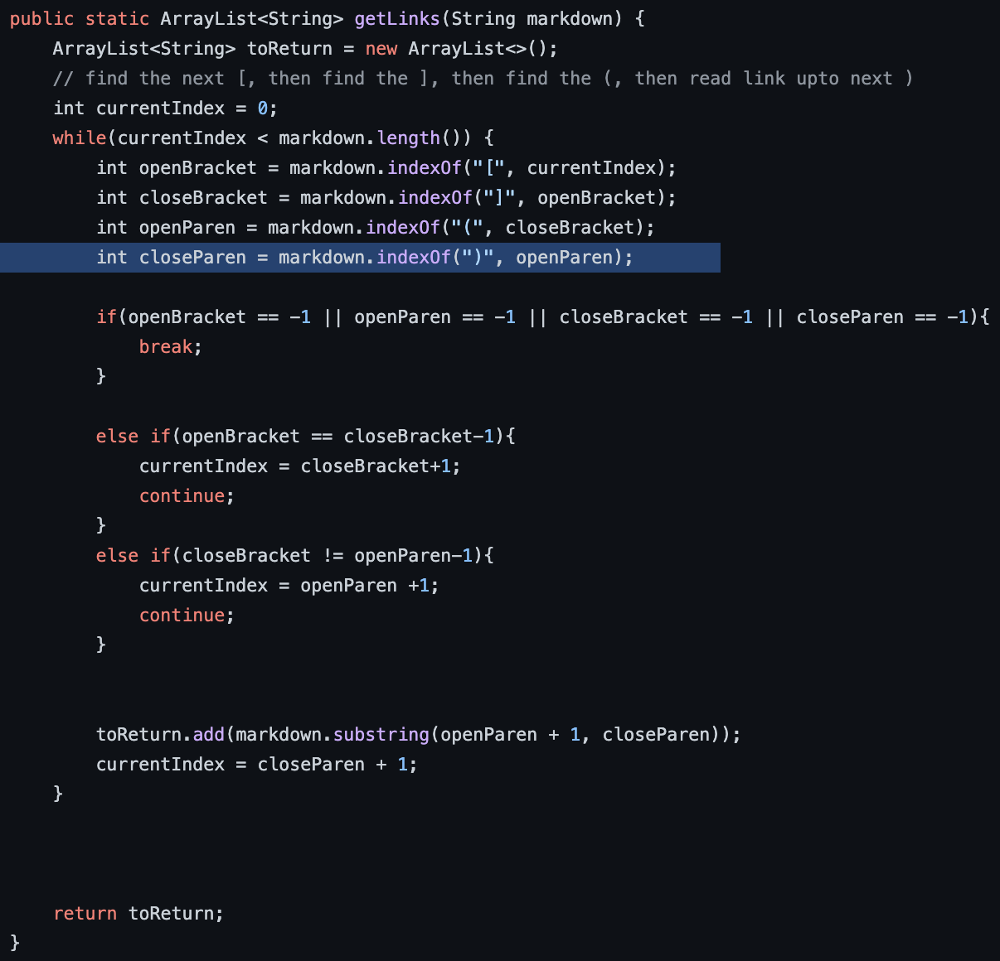
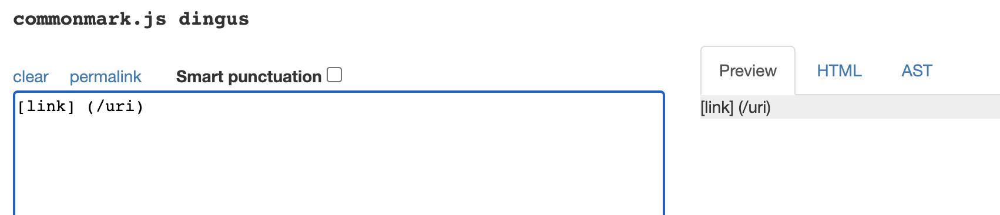
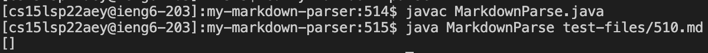
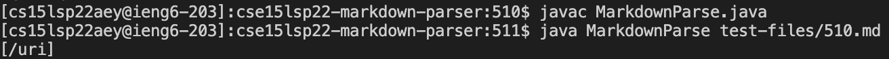
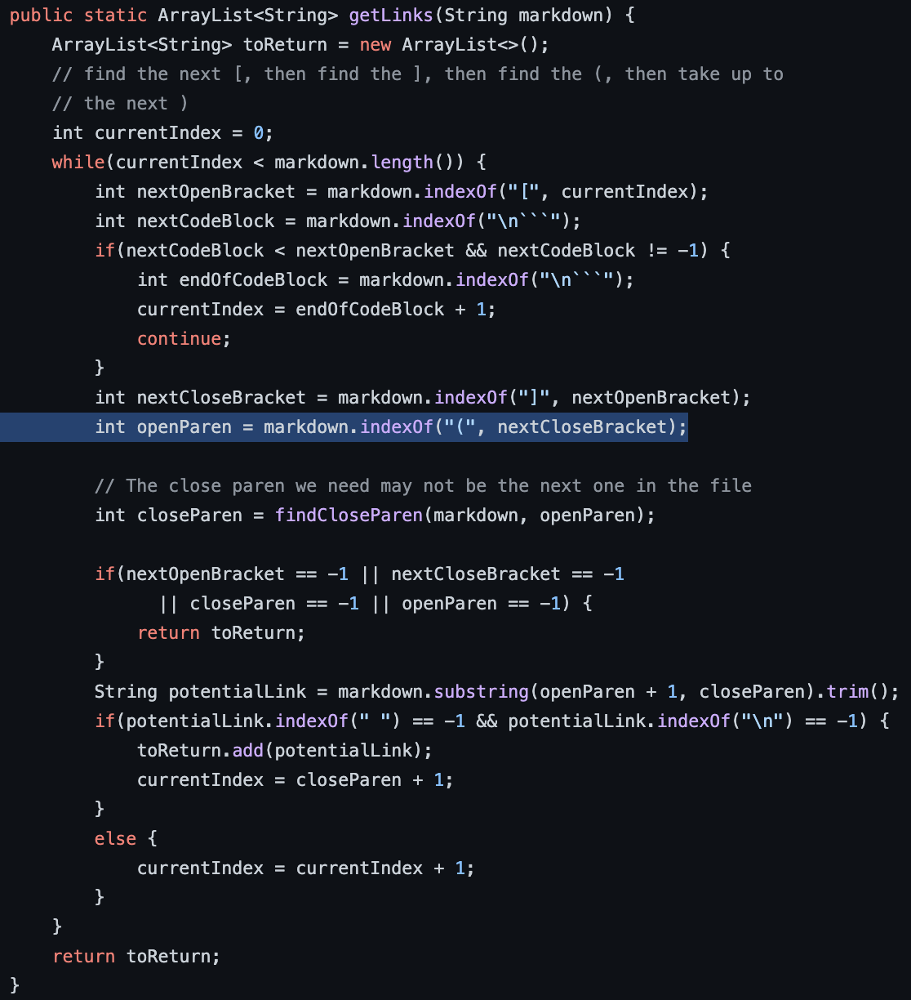

# Lab Report 5
```
Name: Rebecca Nguyen
PID: A16808281
```

---

> # Overview

In this lab report, I will be explaining how I found tests with different results.
I will then be describing which implementation is correct and which is not and also show what *should* be produced based on the [CommonMark demo site](https://spec.commonmark.org/dingus/). Finally, I will describe the bug for implementations that are incorrect.

I will be demonstrating this using two tests.


---

> # Finding Different Results

To find tests with different results, follow these instructions:

* Change the directory to the chosen repository `cd (repository_name)

* Run `make test` in the terminal (the content of makefile is shown down below)

``` 
test: MarkdownParseTest.class MarkdownParse.class run

MarkdownParseTest.class: MarkdownParseTest.java
    javac -cp .:lib/junit-4.13.2.jar:lib/hamcrest-core-1.3.jar MarkdownParseTest.java

MarkdownParse.class: MarkdownParse.java 
    javac -cp .:lib/junit-4.13.2.jar:lib/hamcrest-core-1.3.jar MarkdownParse.java

run: MarkdownParseTest.class.
    java -cp .:lib/junit-4.13.2.jar:lib/hamcrest-core-1.3.jar ord.junit.runner.JUnitCore MarkdownParseTest
```

* Run `time bash script.sh` in the terminal

* Run `bash script.sh > results.txt` in the terminal (this creates a results.txt)

Do this on both directories, then cd out of the directory that you were currently in. Afterwards use `vimdiff` on both `results.txt`, by running:

```
vimdiff my-markdown-parser/results.txt cse15lsp22-markdown-parser/results.txt
```

This command will compare the two `results.txt` and this should appear in your terminal:



**Note:** The purple outlines the files that have different outcomes.

---

> # Test 1: 494.md

The first test I will be looking at that has different results is test-files/494.md:



Click [here](https://github.com/nidhidhamnani/markdown-parser/blob/main/test-files/494.md?plain=1) to access the code for the 494.md test.

According to the CommonMark demo site, the expected outcome should be ```[\(foo\)]```:



> # 494.md Outputs

When running MarkdownParse on 494.md using my program, I got this output:



When running MarkdownParse on 494.md using the staff's program, I got this output:



My program produced ```[\(foo\]``` while the staff's program produced ```[\(foo\)]```. When we compare that to the output produced by the CommonMark demo site (```[\(foo\)]```), the staff's implementation for 494.md is correct, while mine is incorrect.

> # Debugging 494.md



The bug in my program is that it does not account for multiple closed parenthesis `)`. As such, it only takes in whatever is after the **first** open parenthesis `(` and before the **first** closed parenthesis `)`, which is why the output included the second open parenthesis `(`, but not the second closed parenthesis `)`. To fix this code, it should check for the very first open parenthesis `(` and the very last closed parenthesis `)` before adding the contents inside to the list.

---

> # Test 2: 510.md 

The second test I will be looking at that has different results is test-files/4510.md:


Click [here](https://github.com/nidhidhamnani/markdown-parser/blob/main/test-files/510.md?plain=1) to access the code for the 510.md test.

According to the CommonMark demo site, the expected outcome should be ```[]```:



> # 510.md Outputs

When running MarkdownParse on 510.md using my program, I got this output:



When running MarkdownParse on 510.md using the staff's program, I got this output:



My program produced ```[]``` while the staff's program produced ```[/uri]```. When we compare that to the output produced by the CommonMark demo site (```[]```), the staff's implementation for 510.md is incorrect, while mine is correct.

> # Debugging 510.md



The bug in the staff's program is that it does not check whether or not the closed bracket `]` and open parenthesis `(` are right next to each other (no space or character are in between them). As long as the brackets `[]` and parenthesis `()` are present, the content inside the parenthesis `()` will be added to the list. To solve this issue, the code should check and make sure that the index of the open parenthesis `(` is one greater than the index of the closed bracket `]`.


